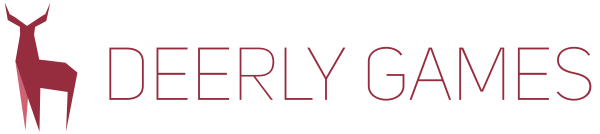

<p align="center">
<a name="top" href="https://github.com/DeerlyGames/aemake"></a>
</p>

## Overview
**aemake** is a superset of premake, so check the premake [**wiki**](https://github.com/premake/premake-core/wiki) if you need documentation. 

**aemake** is invoked in the following way.

```sh
    $ aemake [options] [action]
```

| Options   		| Description  								|
| ---------------	| ----------------------------------------- |
| --cc=clang		| Choose the Clang compiler set. 			|
| --cc=gcc			| Choose the GNU GCC compiler set. 			|
| --help			| Diplay the help information. 				|
| --version			| Display the version number. 				|
| --watch			| Run in loop and rebuild automatically 	|

_____________________________________________________________

| Actions   | Description  									|
| ---------	|  -------------------------------------------- |
| gmake		| Generate GNU makefiles for POSIX, MinGW, and Cygwin |
| vs2005    | Generate Visual Studio 2005 project files |
| vs2008    | Generate Visual Studio 2008 project files |
| vs2010    | Generate Visual Studio 2010 project files |
| vs2012    | Generate Visual Studio 2012 project files |
| vs2013    | Generate Visual Studio 2013 project files |
| vs2015    | Generate Visual Studio 2015 project files |
| vs2017 	| Generate Visual Studio 2017 project files |
| xcode4    | Generate Apple Xcode 4 project files |

### Building Qt4.8
This project relies on the static Qt version, which can be build the following way.

#### Linux
```sh
  $ wget https://download.qt.io/archive/qt/4.8/4.8.6/qt-everywhere-opensource-src-4.8.6.tar.gz | tar xvz -C qt-everywhere-opensource-src-4.8.6
  $ ./configure -opensource -confirm-license -release -static -nomake tests -nomake examples -no-webkit -no-javascript-jit -no-qt3support -no-declarative -no-scripttools -no-script
  $ make -j7
```
#### Windows MinGW
Download the mingw64, and add it to path.
Add this to mkspecs/win32-g++/qmake.conf
QMAKE_LFLAGS		= -static -static-libgcc -static-libstdc++

```sh
  $ configure -platform win32-g++ -opensource -confirm-license -release -static -nomake tests -nomake examples -no-webkit -no-qt3support -no-declarative -no-scripttools -no-script -no-vcproj -no-s60 -no-incredibuild-xge -no-cetest -no-xmlpatterns -no-accessibility -no-exceptions 
  $ mingw32-make -j7
```

## [License](https://github.com/DeerlyGames/Entry/blob/master/LICENSE)

<a href="http://opensource.org/licenses/BSD-2-Clause" target="_blank">

</a>

    Copyright 2017 Deerly Games. All rights reserved.

	Redistribution and use in source and binary forms, with or without
	modification, are permitted provided that the following conditions are met:
	
	   1. Redistributions of source code must retain the above copyright notice,
	      this list of conditions and the following disclaimer.
	
	   2. Redistributions in binary form must reproduce the above copyright
	      notice, this list of conditions and the following disclaimer in the
	      documentation and/or other materials provided with the distribution.
	
	THIS SOFTWARE IS PROVIDED BY COPYRIGHT HOLDER ``AS IS'' AND ANY EXPRESS OR
	IMPLIED WARRANTIES, INCLUDING, BUT NOT LIMITED TO, THE IMPLIED WARRANTIES OF
	MERCHANTABILITY AND FITNESS FOR A PARTICULAR PURPOSE ARE DISCLAIMED. IN NO
	EVENT SHALL COPYRIGHT HOLDER OR CONTRIBUTORS BE LIABLE FOR ANY DIRECT,
	INDIRECT, INCIDENTAL, SPECIAL, EXEMPLARY, OR CONSEQUENTIAL DAMAGES
	(INCLUDING, BUT NOT LIMITED TO, PROCUREMENT OF SUBSTITUTE GOODS OR SERVICES;
	LOSS OF USE, DATA, OR PROFITS; OR BUSINESS INTERRUPTION) HOWEVER CAUSED AND
	ON ANY THEORY OF LIABILITY, WHETHER IN CONTRACT, STRICT LIABILITY, OR TORT
	(INCLUDING NEGLIGENCE OR OTHERWISE) ARISING IN ANY WAY OUT OF THE USE OF
	THIS SOFTWARE, EVEN IF ADVISED OF THE POSSIBILITY OF SUCH DAMAGE.
